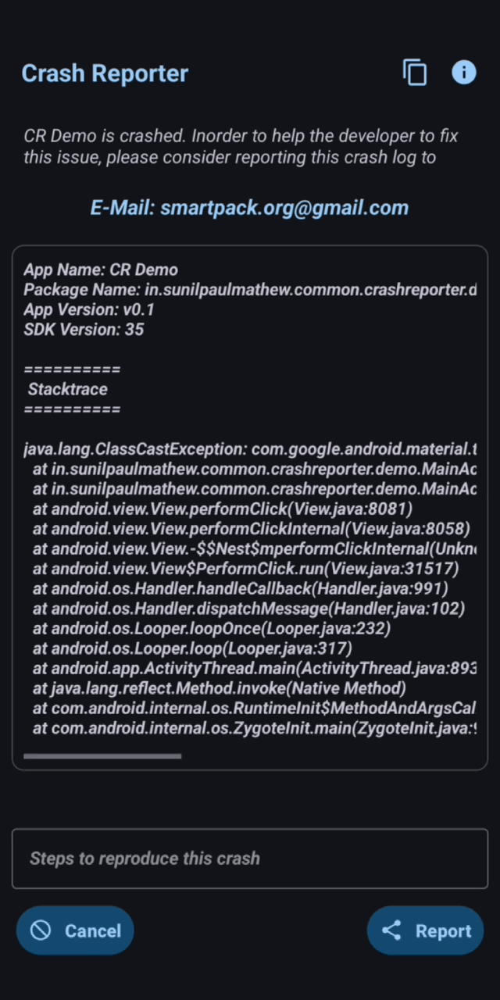

# Crash Reporter


**Crash Reporter** is a lightweight, pure **Java** library designed for real-time crash monitoring and automated reporting for Android applications.



## 📦 Installation

### 🪜 Step 1: Add the JitPack repository to your root-level `build.gradle`

```gradle
allprojects {
    repositories {
        ...
        maven { url 'https://jitpack.io' }
    }
}
```

### 🪜 Step 2: Add the dependency to your app-level `build.gradle`

```gradle
dependencies {
    implementation 'com.github.sunilpaulmathew:CrashReporter:Tag'
}
```

> 🔖 **Note:** Replace **`Tag`** with the latest **[commit ID](https://github.com/sunilpaulmathew/CrashReporter/commits/master "View latest commits")**.

---

## ⚙️ Usage

Initialize the library within the onCreate method of your main activity, immediately after setContentView:

```java
@Override
protected void onCreate(Bundle savedInstanceState) {
    super.onCreate(savedInstanceState);
    setContentView(R.layout.activity_main);

    // Initialize Crash Reporter
    new CrashReporter(contactDetails, this).initialize();

});
```

> 🔖 **Note:** Replace **`contactDetails`** with a String containing your support email, Telegram ID, or any preferred contact method, such as, E-Mail: smartpack.org@gmail.com.

---

## 💡 How it Works

```
- The library monitors for crashes in real-time as long as the Activity in which it was initialized remains active.
- Upon a crash, the library immediately captures the stack trace and other relevant information before the process terminates.
- The library prompts the user to share the crash log to the provided 'contactDetails'.
```

## 📜 License

```
Copyright (C) 2021-2026 sunilpaulmathew <sunil.kde@gmail.com>

This program is free software: you can redistribute it and/or modify it 
under the terms of the GNU General Public License as published by the 
Free Software Foundation, either version 3 of the License, or (at your option) 
any later version.
```

[](https://www.gnu.org/licenses/gpl-3.0.en.html)

---

## 👥 Contributions

We welcome community contributions!  
To contribute:
1. Fork this repository
2. Create a feature branch (`feature/your-feature`)
3. Commit and push your changes
4. Open a Pull Request 🎉

---

💡 *Thank you for supporting open-source Android development with [Crash Reporter](https://github.com/sunilpaulmathew/CrashReporter)!*